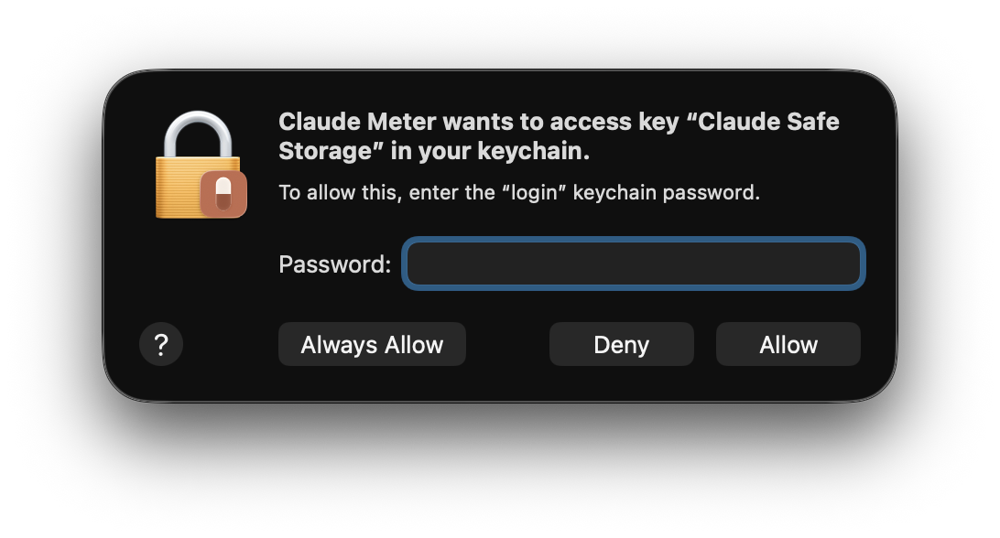
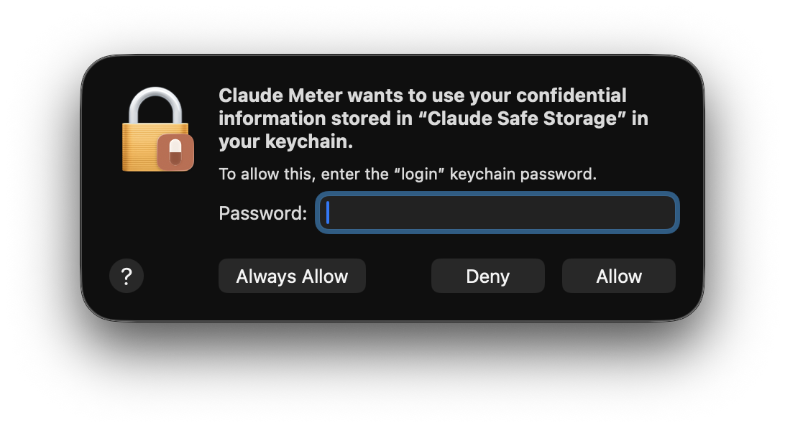

# claude-meter

A macOS menu bar app that displays Claude subscription usage.


When you're on pace to hit the wall before the window resets, the popover surfaces it directly:


## Requirements

- macOS 14 (Sonoma) or newer
- Xcode 15+ (build) — the Xcode command-line tools alone are not enough; the asset compiler and SwiftUI previews ship with full Xcode
- **Claude desktop installed and signed in.** claude-meter reads Claude desktop's cached OAuth token from the macOS Keychain — it does not run its own auth flow. The desktop app does **not** have to be running; it just has to have signed in at least once. Once that's done, claude-meter tracks all activity on your account, including everything you do in Claude Code or other CLI tools — Claude desktop is only used as the auth source.

If you don't have it: <https://claude.ai/download>.

## Quickstart

```sh
git clone https://github.com/<your-fork>/claude-meter.git
cd claude-meter
./build.sh
```

`build.sh` runs `xcodebuild` (Release configuration, output pinned to `./build/` so it isn't lost in Xcode's hashed DerivedData) and then `open`s the app. Safe to re-run — incremental rebuilds are fast.

**First launch:** macOS shows two Keychain dialogs in sequence so claude-meter can read Claude desktop's cached OAuth token. Each one asks for your login password. This is the cost of reading another app's keychain item — the two prompts correspond to two separate ACL authorizations on the underlying entry. Click `Always Allow` on both and you'll never see them again; even `Allow` works thanks to the persistent cache claude-meter writes after the first successful read.

<p>
  
  
</p>

Subsequent launches are silent.

The app has `LSUIElement=true`, so no Dock icon appears — look for the vessel icon in the menu bar (top-right of the screen). Click it for the popover; ⌘, opens the settings panel.

## From Xcode

If you'd rather build interactively:

```sh
open ClaudeMeter/ClaudeMeter.xcodeproj
```

Then hit ⌘R.

## Tests

```sh
xcodebuild -project ClaudeMeter/ClaudeMeter.xcodeproj \
           -scheme ClaudeMeter \
           -destination 'platform=macOS' test
```

## Layout

- `ClaudeMeter/` — Xcode project and app source
- `docs/` — architecture, metrics, UI, brand, API, auth, backlog
- `assets/` — brand assets (canonical icon SVG) and `screenshots/` for README images
- `tools/render-icon.swift` — re-renders the AppIcon set from the SVG spec
- `tools/reset-keychain-cache.sh` — wipes the persistent Safe Storage cache to re-test the first-launch flow
